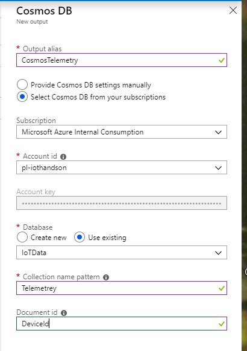

## Lab 4

In this lab, we are going to create an Azure Stream Analytics job that will take the telemetry data from the Simulated Device and send it to CosmosDB as the output. The Stream Analytics job will filter the messages where the field `level=normal`.

## Create Azure Stream Analytics (ASA) Job

1. Log into the [Azure portal](https://ms.portal.azure.com)
2. Add an Azure Stream Analytics (ASA) Job
  - Click on "+ Create a resource"
  
     <p align="center">
         
    
      </p>

  - In the "Search the marketplace" box, type in "Stream Analytics". Click on the "Stream Analytics job" option that shows up.
  
     <p align="center">
         
     </p>    
  
    1. Click on the "Stream Analytics job" that shows up in the results. Click "Create".
  
       <p align="center">
           
       </p>

    1. Enter a name for your job.  eg. "HandsOnLab-ASA"
    1. Choose your subscription. Use the same subscription you used to provision everything else in this lab.
    1. Choose your Resource Group. Use the existing Resource Group that was created previously. This will make it easier to delete all the resources when you are done with the lab.
    1. Choose a Location.  Try and choose the same location as where the rest of your solution has been provisioned.
    1. Select "Cloud" for the Hosting Environment. With the IoT Edge gateway solution, you can now push ASA jobs down to the edge and have ASA jobs run locally on premise on your gateway solution.
    1. Leave the Streaming Units at 1. Streaming Units are the pool of computation resources available for the Stream Analytics job.
    1. Click "Create". Feel free to click the "Pin to dashboard" check box. This will add the newly created ASA service to the main Azure portal dashboard. 
      
      <p align="center">
          
      </p>   
  
  - Wait for the job to be created. You will see a notification banner that will pop up in the top right corner of the Azure portal to indicate the status of the job. This banner will disappear automatically. If you wish to see all the past notifications, click the bell icon. 
      
      <p align="center">
          
      </p>   
  
- Next, you will add an Input for the Stream Analytics job.  
  - If you pinned the ASA service to the dashboard, you will see the ASA tile on the main Azure portal page. Click it. 
      
      <p align="center">
          
      </p>   
       
     If not, click "Resource Groups" -> Your *resource group name* -> Your *ASA name*
      
      <p align="center">
          
      </p>   
       
  - Under the "Job Topology" category, click on "Inputs".
  - Click "+ Add Stream input".
      
      <p align="center">
          
      </p>   
      
  - In the pop up menu that appears, select "IoT Hub" 
      <p align="center">
          
      </p>  
  
  - In the "New Input" blade that appears, fill in the fields:
    - Input Alias: This is a free form text name for the input to the ASA job. eg. "IoTHub"
    - Choose "Select IoT Hub from your subscriptions". We will be connecting the ASA job to the IoT Hub you created and collecting streaming data from that existing IoT Hub
    - Subscription: Choose the name of your IoT Hub from your current subscription
    - IoT Hub: Choose the IoT Hub you have been using for the lab
    - Endpoint: Messaging
    - Shared Access Policy Name: iothubowner
    - Consumer Group: asa (we created this earlier)
    - Event Serialization Format: JSON
    - Encoding: UTF-8
    - Event Compression Type: None
    - Click "Save" and wait for the input to be created. 
    <p align="center">
       
    </p>   
  
- Next, add an Output for the Stream Analytics job.
  1. Under the "Job Topology" category, click on "Outputs".
        
      <p align="center">
          
      </p>
  
  1. Click "+ Add" in the blade to the right and select "CosmosDB"
  1. Fill out the values in the "New Output" blade. 
    - Enter in any free form text for the "Output alias". eg. "CosmosDBTelemetry"
 
    <p align="center">
        
    </p>      

    - Wait for the input and output to be created.  Check the Notifications in the portal for a successful connection test.  
    
- Create an ASA Query.
   - Under the "Job Topology" category, click on "Query". The inline query editing tool will already have some stub code inserted. You will make some modifications to the query. 
    - Enter a query like the following: (Note, if you named your Input and Output bindings something different then you will have to update the query parameters to correspond correctly)

  ```sql
    SELECT
      *
    INTO
      [CosmosDBTelemetry]
    FROM
      [IoTHub]
  ```

    - Click "Save". 
    - If you wish to run a test on your newly generated query, you will need to upload some sample data that the ASA Query tool will use to run the query. To generate a sample file, you can either manually generate your own file or get a sampling of data from the IoT Hub input. Click the elipses (...) beside the IoTHub input and click "Sample data from input" to start collecting data. Click the "Upload sample data from file" option once you have created a sample file and then run the query test by clicking the "Test" button.

      <p align="center">
         
      </p>
       
- Start the ASA Job
  1. Click on "Overview"
  1. Click the "Start" button
   
      <p align="center">
          
      </p>  
      
  1. For the "Job output start time", click "Now"
  1. Click "Start"
   
      <p align="center">
          
      </p>  

- Once the job is running, go to your CosmosDB database and click on Data Explorer to see the data added.

    <p align="center">
         
    </p>  


[Back to Main HOL Instructions](/README.md)