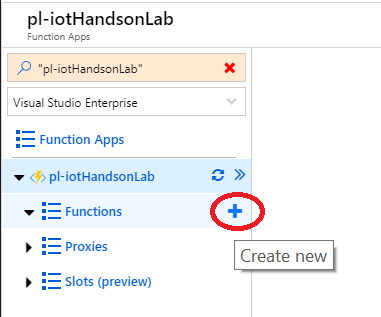

# Lab 5

## Create Azure Function triggered by a change in CosmosDB document

In this lab, you will create an Azure function that will be used to programmatically send data back to the Simulated Device. The Azure function that you will create will be triggered by the CosmosDB Change Feed. 

### Create a Function

In the next part of this lab, you will be creating a C# Azure Function that will get triggered whenever there is a change in the CosmosDB Change Feed. For ease of getting through the lab, we have provided the code that you will need to write the function. The code doesn't do anything more than logging a message in the log window..

1. Navigate to the Azure portal: https://portal.azure.com
2. Click the ‘+’ sign and type in “function app”
    <p align="center">
    
    </p>

3. Click the “Create” button <br> 
    <p align="center">
    
    </p> 

4. Fill out the required values to create a function <br>
  - Provide the function app a name (eg. pl-iot-hol). The name must be unique in the azurewebsites domain.
  - Select your Azure subscription
  - If given an option to choose between "Windows", "Linux" and "Docker" as the OS, choose "Windows" 
  - Select your existing subscription that you are using for the hands on lab
  - For hosting plan, select “consumption plan”
  - For location, choose the closest data centre (eg. Canada East)
  - For storage, select “create new” and provide a name for the storage
  - You can leave Application Insights turned off
  - Click “Create” <br>
      <p align="center">
    
    </p>
  
5. Once the Function app is created, click the function (the function icon is the one in the shape of a lightning bolt)

    <p align="center">
    
    </p>

6. Click the ‘+’ sign beside the “Functions” node in the hierarchy tree

    <p align="center">
    
    </p>

7. Click on “In-portal” then "Continue"
    <p align="center">
    
    </p>

8. There is a little issue in the new function UI and the CosmosDB Trigger we need is not there if the FunctionApp is new. So for now, pick "Webhook + API" and click "Create"
    <p align="center">
    
    </p>

9. Click the ‘+’ sign beside the “Functions” node in the hierarchy tree
    <p align="center">
    
    </p>

10. Now, pick "Cosmos DB trigger" and click "Create"
    <p align="center">
    
    </p>

    **Note**: If you get a message telling you the Extensions are not installed, click **Install**. This may take a minute or two.

11. In the "New Function" window, click on the "new" link beside the Azure CosmosDB account connection
    <p align="center">
    
    </p>

11. In the "Connection" window, make sure you select your subscription and pick the right Database Account. Click "Select"
    <p align="center">
    
    </p>

12.	Fill in the rest of the values in the "New Function" window
    - **Collection Name**: IoTData
    - **Database Name**: Telemetry
    - Leave the default for the other values
    - Click “Create”
  
    <p align="center">
    
    </p>

13.	Expand the “Logs” view at the bottom of the page

14.	Now replace all the code with the following:

```c
#r "Microsoft.Azure.DocumentDB.Core"
using System;
using System.Collections.Generic;
using Microsoft.Azure.Documents;

public static void Run(IReadOnlyList<Document> input, ILogger log)
{
    if (input != null && input.Count > 0)
    {
        log.LogInformation("Documents modified " + input.Count);

        foreach (Document doc in input)
        {
            log.LogInformation("Modfied Document Id " + doc.Id);
        }
    }
}
```

  - Click “Save”

   <p align="center">
    
    </p>

### Run the Simulated Device application

Now run the Simulated Device application and notice the function is executed everytime the document is updated in CosmosDB.

[Back to Main HOL Instructions](/README.md)